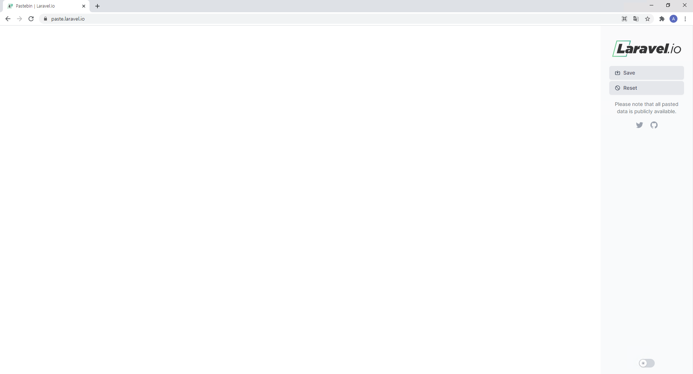
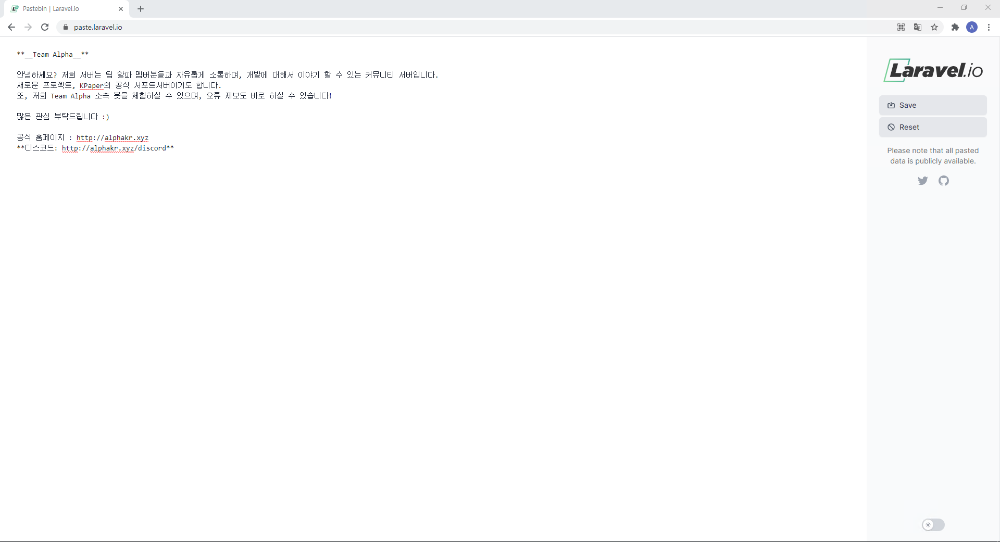
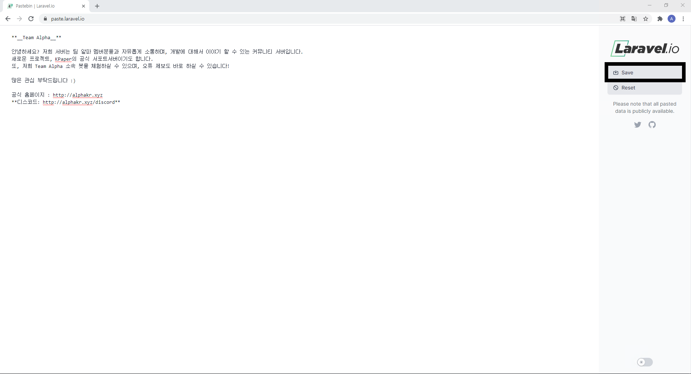
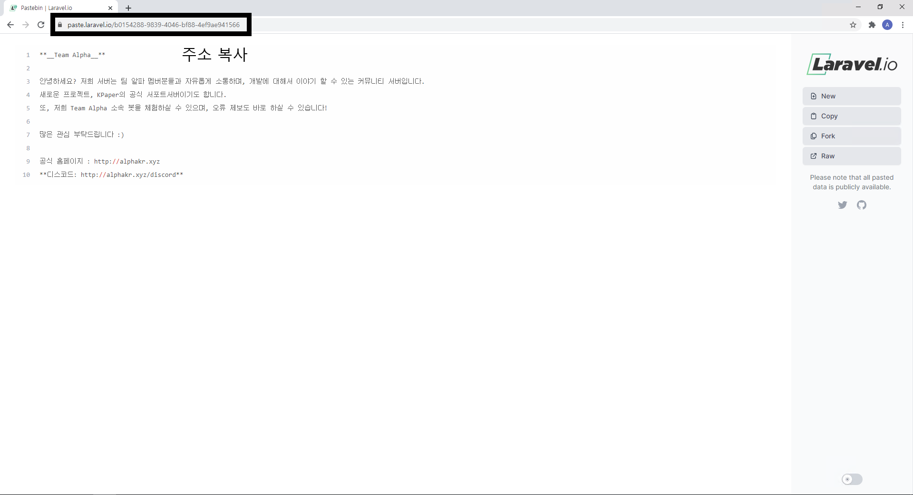

# 홍보지 입력 방법

## 홍보지는 기술적 문제로 현재 Paste Laravel을 통해 제공중입니다.

### 1. [Paste Laravel](https://paste.laravel.io/) 접속

[Paste Laravel](https://paste.laravel.io/)에 접속해 주세요.

### 2. 홍보지 입력

좌측에 홍보지를 붙여넣어 주세요.

### 3. 저장

입력한 내용 오른쪽에 있는 Save를 눌러주세요.

### 4. 주소 복사

저장 후 바뀐 주소창에 있는 주소를 복사하세요.

### 5. 입력란에 주소 붙여넣기

파트너 신청 페이지로 돌아와서, 입력란에 주소를 붙여넣으시면 됩니다.
